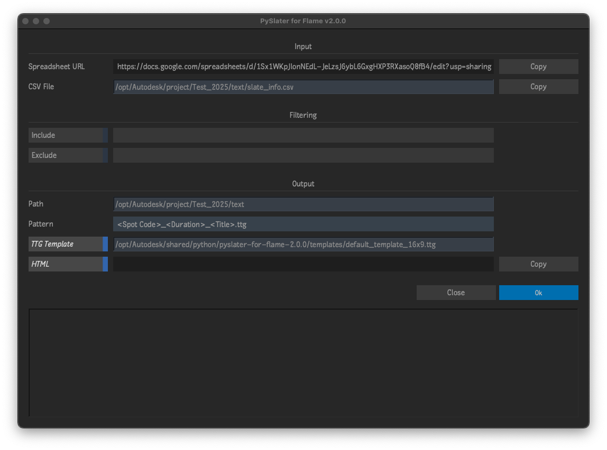

# PySlater for Flame
Plugin for [Autodesk Flame](http://www.autodesk.com/products/flame) software.

PySlater is a python class for generating TTGs files from CSV data.  This repository adds a menu to use the PySlater class from within Flame.  

Detailed explanation of this script and how it fits into a complete slate workflow at [this Logik forum post](http://forum.logik.tv/t/another-slate-workflow/9434).

## Compatibility
|Script Version|Flame Version|
|---|---|
|v2.X.X|Flame 2025 and newer|
|v1.X.X|Flame 2023.3.2 up to 2024.2|

## Installation

### Flame 2025 and newer
To make available to all users on the workstation, copy `pyslater_for_flame.py` to `/opt/Autodesk/shared/python/`

For specific users, copy `pyslater_for_flame.py` to the appropriate path below...
|Platform|Path|
|---|---|
|Linux|`/home/<user_name>/flame/python/`|
|Mac|`/Users/<user_name>/Library/Preferences/Autodesk/flame/python/`|

### Flame 2023.3.2 up to 2024.2
To make available to all users on the workstation, copy `pyslater_for_flame.py` to `/opt/Autodesk/shared/python/`

For specific users, copy `pyslater_for_flame.py` to `/opt/Autodesk/user/<user name>/python/`

### Last Step
Finally, inside of Flame, go to Flame (fish) menu `->` Python `->` Rescan Python Hooks

## Menu
- Flame Fish Menu `->` Slates... `->` PySlater

## Acknowledgements
Heavily influenced by this [Flameslate PHP script](http://github.com/ManChicken1911/flameslater)

UI Templates courtesy of [pyflame.com](http://www.pyflame.com)
